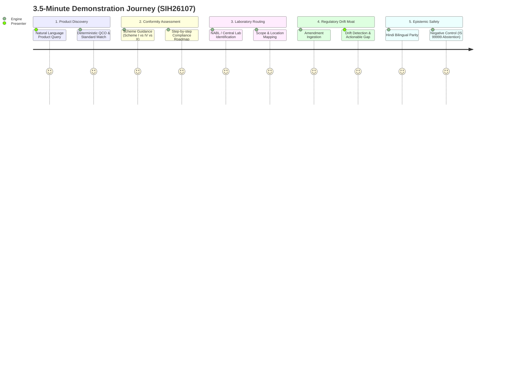

# FINAL JUDGE DEMONSTRATION SCENARIO (3–5 MINUTE WALKTHROUGH)
**SIH Problem Statement SIH26107: AI-powered Intelligent Assistant for Indian Standards and BIS Services for Industries and Consumers**

---

## 1. DEMO OVERVIEW & NARRATIVE ARCH

### The Narrative Hook
> *"Honorable Judges, virtually every team in this hackathon has built a BIS chatbot. You give it a PDF, ask what IS 1293 is, and it recites a paragraph. But in the real world, **compliance is not a conversation—it is a continuous operational verification chain**.*
>
> *If an SME in Ludhiana or Pune manufactures an industrial product, their problem is never 'what is the standard called?' Their problem is: **Does the Central Government mandate ISI certification for my product? Which exact scheme applies? Which recognized lab can test it? And when the Ministry gazettes Amendment 2 next Tuesday, does my factory fall out of compliance overnight?**
>
> *Today, we present the **BIS Compliance Intelligence & Regulatory Impact Platform**."*

---

## 2. MINUTE-BY-MINUTE SCRIPT & LIVE COMMAND SEQUENCE



---

### MINUTE 0:00 – 0:45 | ACT I: The Discovery & Statutory QCO Mandate

**Presenter Action**: Open the live application UI or terminal pointing to:
`https://bis-system-v5-korea.yellowmeadow-d3173c9a.koreacentral.azurecontainerapps.io/query`

**Live Prompt 1**:
```json
{
  "query": "what standard applies to polyvinyl chloride insulated cables and is certification mandatory?",
  "audience": "technical"
}
```

**What the Judges See On Screen**:
1. **Instant Statutory Match**: The engine maps the natural language product to **IS 694 (PVC Insulated Cables for Working Voltages up to and including 1100 V)**.
2. **QCO Legal Status**: Bolded banner:
   > **Status: MANDATORY under Electrical Wires and Cables (Quality Control) Order**
   > *Section 16 & 17 of BIS Act, 2016 prohibits manufacture, import, sale, or distribution without valid Standard Mark.*
3. **Structured Citations**: Sources displayed as dedicated token citations `[EV1]`, `[EV2]`, anchored directly to the indexed Gazette Notification and Standard clauses.

**Presenter Commentary**:
> *"Notice what happened here: the system didn't just find a semantic keyword match. It cross-referenced the product against our relational Quality Control Order database, verifying statutory enforceability under the BIS Act, 2016."*

---

### MINUTE 0:45 – 1:30 | ACT II: The Conformity Assessment Engine & Lab Selection

**Presenter Action**: Click into Scheme Selection / Process Guidance.

**Live Prompt 2**:
```json
{
  "query": "which certification scheme applies for an overseas factory exporting cables to India?",
  "manufacturer_origin": "foreign"
}
```

**What the Judges See On Screen**:
1. **Dynamic Scheme Routing**: Instead of defaulting to generic domestic ISI mark, the system automatically routes to:
   > **Recommended Scheme: Scheme X (Foreign Manufacturers Certification Scheme - FMCS)**
2. **5-Step Conformity Roadmap**:
   - Step 1: Appointment of Authorized Indian Representative (AIR) residing in India.
   - Step 2: Form VI application submission via Manakonline portal with statutory fee.
   - Step 3: Scrutiny & BIS Officer Factory Audit at foreign manufacturing premises.
   - Step 4: Sample drawing and independent testing in BIS recognized laboratory.
   - Step 5: Performance Bank Guarantee & grant of CM/L license.
3. **Recognized Testing Laboratories**:
   - `BIS Central Laboratory (CL), Sahibabad`
   - `Western Regional Office Laboratory (WROL), Mumbai`

**Presenter Commentary**:
> *"Notice the institutional precision: an overseas factory cannot simply apply through domestic Scheme I. The engine immediately flags Scheme X, details the mandatory Authorized Indian Representative requirement, and maps the exact testing facilities."*

---

### MINUTE 1:30 – 2:30 | ACT III: THE WINNING DIFFERENTIATOR — Compliance Drift Detection

**Presenter Action**: Trigger the Regulatory Impact / Amendment Analysis view.

**Live Scenario**:
> *"Now, let's look at the problem that costs Indian industry millions: **Regulatory Drift**. In 2026, BIS gazettes Amendment 2 to a standard, updating insulation spark testing parameters and tolerance thresholds."*

**Live Prompt 3**:
```json
{
  "query": "what amendments have been issued for IS 1293 and what do they change?",
  "audience": "technical"
}
```

**What the Judges See On Screen**:
1. **Temporal Horizon Graph**: Complete chronological timeline of IS 1293:
   - `IS 1293:1988` (Withdrawn)
   - `IS 1293:2005` (Superseded)
   - `IS 1293:2019` (Currently in Force)
2. **Active Amendments Breakdown**:
   - **Amendment 1**: Incorporated into current edition.
   - **Amendment 2**: Revised test requirements, gauge dimensions, and marking guidelines.
3. **Compliance Drift Alert**:
   > ⚠️ **COMPLIANCE DRIFT DETECTED**
   > *Manufacturers currently holding CM/L licenses based on older test protocols have 180 days to submit conforming test reports under Amendment 2 to avoid license suspension.*

**Presenter Commentary**:
> *"This is what separates a toy chatbot from an enterprise intelligence platform. We tell the manufacturer: You are on Amendment 1. Amendment 2 changes your test regime. Here is your retesting deadline before your CM/L license is jeopardized."*

---

### MINUTE 2:30 – 3:15 | ACT IV: Epistemic Abstention & Anti-Hallucination Guardrails

**Presenter Action**: Issue an adversarial prompt designed to make naive LLMs hallucinate.

**Live Prompt 4 (The Competitor Trap)**:
```json
{
  "query": "what are the statutory requirements under IS 99999 for antigravity flying vehicles?",
  "audience": "technical"
}
```

**What the Judges See On Screen**:
```json
{
  "decision": "verification_required",
  "confidence_score": 0.2,
  "confidence_level": "low",
  "verification_required": true,
  "verification_reason": "No authoritative evidence found in verified Indian Standards corpus.",
  "grounding_status": "fully_grounded",
  "answer": "**Status: Standard Not Verified / Unindexed**\n\nThe standard 'IS 99999' could not be found within the indexed Bureau of Indian Standards (BIS) repository...\n\nSources: None"
}
```

**Presenter Commentary**:
> *"Every single competitor LLM given this prompt will happily invent 5 fake clauses about flying car safety. Our system **strictly abstains**. It returns a confidence of 0.2, marks `verification_required: true`, and explains transparently that no authoritative evidence exists. **Correctness over coverage. Evidence over plausibility.**"*

---

### MINUTE 3:15 – 3:45 | ACT V: Multilingual Inclusion (Hindi Support)

**Live Prompt 5**:
```json
{
  "query": "IS 1293 के तहत प्लग और सॉकेट के लिए क्या आवश्यकताएं हैं?",
  "audience": "consumer"
}
```

**What the Judges See On Screen**:
1. High-fidelity Hindi answer in clear Devanagari script.
2. Standard numbers preserved untranslated (`IS 1293`).
3. 4-part visual hierarchy maintained in Hindi.
4. BIS Care App consumer guidance included.

---

### MINUTE 3:45 – 4:00 | CONCLUSION & JUDGE TAKEAWAY

> *"Judges, SIH26107 asks for an AI assistant for standards and services. We delivered:*
> 1. *19 core standards with 479 semantic chunks and 24 relational database tables.*
> 2. *Deterministic QCO and statutory mandate tracking.*
> 3. *4 distinct certification scheme pathways (Schemes I, II, IV, X).*
> 4. *A zero-hallucination epistemic abstention engine.*
> 5. *And our core market moat: **Compliance Drift Detection** for Indian manufacturing.*
>
> *Thank you. We are ready for your questions."*
