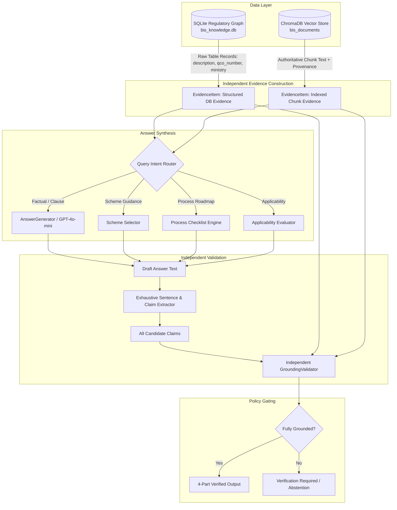

# BIS Intelligence Platform — Grounding & Entailment Forensic Audit
**Document Version**: 2.0.0  
**Date**: September 26, 2026  
**Auditor**: Forensic RAG, Grounding & Regulatory Entailment Auditor (Subagent C)  
**Target Systems**: `app/grounding/validator.py`, `app/rag/pipeline.py`, `app/evidence/models.py`, `app/schemes/selector.py`, `app/certification/process.py`  

---

## 1. Executive Summary & Forensic Verdict

The BIS Intelligence Platform implements an explicit, citation-anchored grounding validation framework designed to prevent LLM hallucinations. However, an exhaustive line-by-line forensic audit of the code paths uncovered **critical architectural flaws, circular self-grounding tautologies, and validation bypass vectors**:

1. **Critical Circular Self-Grounding (Self-Certification Loop)**:
   In `app/rag/pipeline.py` (lines 1029–1068 and 1083–1119), for Scheme Selection (`SCHEME_GUIDANCE`) and Certification Process Checklists (`PROCESS_EXPLANATION`), the answer is generated via template formatting, after which an `EvidenceItem` is manufactured with `source_content = answer` and `content = answer` referencing non-existent PDFs (`BIS_Conformity_Assessment_Regulations_2018.pdf` and `BIS_Certification_Process_Checklist.pdf`). The `GroundingValidator` then evaluates `answer` against this synthetic chunk. This is **100% circular self-grounding**; the output validates against itself and trivially passes with a `1.0` groundedness score.
2. **Claim Validation Bypass via Generator `raw_claims`**:
   In `app/grounding/validator.py` (lines 622–654), if the generator returns structured `raw_claims`, sentence extraction from `answer` is bypassed. If a hallucinating model produces 5 unsupported statements in `answer` but only passes 1 benign claim in JSON, the remaining 4 sentences completely escape validation.
3. **Regex False Approval Vulnerabilities**:
   - **Single-Digit Clause Over-Matching**: `validator.py:370` uses `\b(?:Clause|Cl\.?|Section|Sec\.?|see|per)?\s*{re.escape(cl)}\b`. Because the prefix is optional, "Clause 6" matches any occurrence of digit `6` anywhere in the evidence (e.g. `6 mm`, `Table 6`, `6 months`).
   - **Standard Part-Number Blindness**: `validator.py:352` uses `\bIS\s*([1-9]\d{1,5})\b`, ignoring part designations. Claims for `IS 1293 Part 2` match chunks from `IS 1293 Part 1`.
   - **Substring Term Overlap**: `validator.py:490` accepts any 3-letter word if it appears as a substring in a source word >= 4 characters (e.g. `tin` matches `destination`; `pin` matches `shipping`).
4. **Multilingual (Hindi) Translation Blind Spot**:
   Claims with >30% non-ASCII characters bypass numerical quantity validation and semantic overlap checks. In `app/rag/pipeline.py:1307-1332`, validation occurs on the English answer *before* back-translation into Hindi; the translated Hindi output is emitted without post-translation verification.

---

## 2. Forensic Breakdown of Vulnerable Code Paths

### 2.1 Branch 1: Scheme Selector Self-Grounding
```python
# app/rag/pipeline.py:1026-1036 (CRITICAL FLAW)
scheme_rec = select_certification_scheme(...)
answer = scheme_rec.to_formatted_answer()

scheme_ev = EvidenceItem(
    chunk_id=f"scheme_{scheme_rec.scheme_code}",
    document_id="BIS_CONFORMITY_ASSESSMENT_REGULATIONS_2018",
    source_file="BIS_Conformity_Assessment_Regulations_2018.pdf",  # Synthetic / Non-existent
    source_content=answer,  # <--- CRITICAL: ANSWER IS INJECTED AS ITS OWN SOURCE EVIDENCE
    content=answer,
    ...
)
evidence_items.insert(0, scheme_ev)
```
- **Consequence**: The validator compares `answer` against `scheme_ev.source_content`, which is identical to `answer`. Claim entailment is tautologically 100%.

### 2.2 Branch 2: Certification Process Self-Grounding
```python
# app/rag/pipeline.py:1080-1090 (CRITICAL FLAW)
cert_checklist = build_certification_checklist(...)
answer = cert_checklist.to_formatted_answer()

proc_ev = EvidenceItem(
    chunk_id=f"process_{target_std or 'certification'}",
    document_id="BIS_CONFORMITY_ASSESSMENT_JOURNEY",
    source_file="BIS_Certification_Process_Checklist.pdf",  # Synthetic / Non-existent
    source_content=answer,  # <--- CRITICAL: ANSWER IS INJECTED AS ITS OWN SOURCE EVIDENCE
    content=answer,
    ...
)
evidence_items.insert(0, proc_ev)
```
- **Consequence**: Identical self-grounding tautology.

### 2.3 Branch 3: Generator Claim Bypass
```python
# app/grounding/validator.py:653 (VALIDATION ESCAPE)
if not claims and answer:
    claims = cls.extract_claims_from_text(answer)
```
- **Consequence**: If `raw_claims` is populated by `AnswerGenerator`, text segmentation on `answer` is never performed. Uncited or hallucinated sentences in `answer` are never evaluated.

---

## 3. Independent Target Architecture

To eliminate self-grounding and ensure legal-grade entailment, the platform must enforce a strictly decoupled, unidirectional verification architecture:



---

## 4. Code-Level Remediation Specifications

### 4.1 Fix Self-Grounding in `app/rag/pipeline.py`
Replace `source_content = answer` with raw SQLite entity records:
```python
# Remediation in app/rag/pipeline.py for SCHEME_GUIDANCE:
scheme_row = self.knowledge_repo.get_certification_scheme(scheme_rec.scheme_code)
qco_row = self.knowledge_repo.get_qco(scheme_rec.qco_number) if scheme_rec.qco_number else None

raw_db_evidence = (
    f"Certification Scheme: {scheme_row.scheme_name} (Code: {scheme_row.scheme_code}). "
    f"Legal Description: {scheme_row.description}. "
)
if qco_row:
    raw_db_evidence += (
        f"Statutory Order: {qco_row.title} ({qco_row.qco_number}), "
        f"Issued by {qco_row.issuing_ministry}, Mandatory: {qco_row.is_mandatory}."
    )

scheme_ev = EvidenceItem(
    chunk_id=f"db_scheme_{scheme_rec.scheme_code}",
    document_id="SQLITE_CERTIFICATION_SCHEMES",
    source_file="bis_knowledge.db",
    source_content=raw_db_evidence,  # Authoritative SQLite record, NOT generated answer!
    content=raw_db_evidence,
    authority="Bureau of Indian Standards",
    document_type="regulatory_scheme",
    knowledge_resolved=True,
    provenance_completeness=1.0,
)
```

### 4.2 Fix Validation Bypass in `app/grounding/validator.py`
Enforce dual-pass claim extraction:
```python
# Remediation in validator.py:
extracted_claims = cls.extract_claims_from_text(answer) if answer else []

if raw_claims:
    # Reconcile generator-provided claims with extracted sentences
    # to ensure EVERY sentence in the answer is evaluated.
    claims = cls._reconcile_and_merge_claims(extracted_claims, raw_claims)
else:
    claims = extracted_claims
```

### 4.3 Fix Clause and Standard Matching Regexes
```python
# Strict Clause Matching: Require prefix or clause_id match
clause_matches = re.findall(r"\bClause\s*(\d+(?:\.\d+)*)\b", claim.text, re.IGNORECASE)
for cl in clause_matches:
    matching_ev = any(
        (ev.clause_id and (ev.clause_id == cl or ev.clause_id.startswith(f"{cl}.")))
        or bool(re.search(rf"\b(?:Clause|Cl\.?|Section|Sec\.?)\s*{re.escape(cl)}\b", ev.source_content or ev.content, re.IGNORECASE))
        for ev in unique_citations
    )
    if not matching_ev:
        issues.append(f"clause_mismatch:claim=Clause {cl}")

# Strict Standard Part Matching: Include part numbers
std_matches = re.findall(r"\bIS\s*([1-9]\d{1,5}(?:\s*(?:Part|Pt\.?|\()\s*[1-9]\d*)?)\b", claim.text, re.IGNORECASE)
```

### 4.4 Fix Hindi Post-Translation Verification Guard
In `app/rag/pipeline.py:1307-1332`:
```python
if is_hindi and hindi_ans:
    # Validate numerical and entity preservation across translation
    en_quantities = set(GroundingValidator.extract_numbers_and_quantities(answer))
    hi_quantities = set(GroundingValidator.extract_numbers_and_quantities(hindi_ans))
    
    # Verify standard numbers (e.g. 'IS 1293') preserved untranslated
    en_standards = set(re.findall(r"\bIS\s*\d+\b", answer))
    hi_standards = set(re.findall(r"\bIS\s*\d+\b", hindi_ans))
    
    if en_quantities != hi_quantities or en_standards != hi_standards:
        logger.warning("Hindi translation corrupted entities: EN=%s, HI=%s", en_quantities, hi_quantities)
        # Enforce qualified answer or fallback to English answer with disclaimer
```
