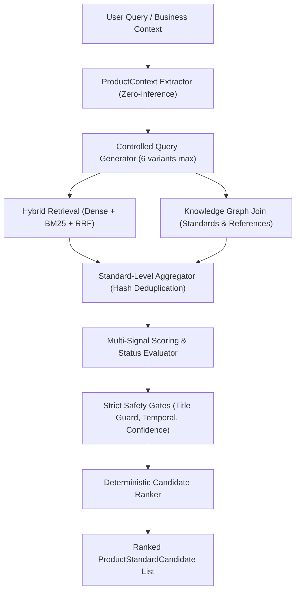

# Phase 11 — Product-to-BIS Standard Mapping Engine: Verification Report

**Status:** Verified & Complete  
**Baseline Test Count Before Phase 11:** 462  
**Current Test Count After Phase 11:** 503 passing (100% green, 0 failures, 0 regressions)  
**Evaluation Dataset:** 25 product records (`data/evaluation/product_standard_eval_dataset.json`)  
**Date:** September 11, 2026  

---

## Executive Summary

Phase 11 introduces the **Product-to-BIS Standard Mapping Engine** for the ComplyWise compliance intelligence backend. The engine conservatively identifies, scores, aggregates, and ranks candidate Indian Standards (IS) for structured product contexts without crossing the critical boundary into legal applicability determination.

All strict project constraints and negative requirements have been rigorously upheld:
- **Zero Applicability Claims:** Candidate mappings never claim "mandatory", "legally required", "certified", "compliant", or "licence required".
- **Zero Unstated Inference:** Attributes not explicitly stated in query or business profile remain `None`.
- **Epistemic Honesty:** If no candidates are found, the engine returns `NO_CANDIDATE_FOUND` with `VERIFICATION_REQUIRED`, never asserting "No BIS standard exists" or "No standard applies".
- **Title-Only Guard:** A title match alone is capped at `POSSIBLE_CANDIDATE` and flagged for verification; `STRONG_CANDIDATE` strictly requires corroborating clause or content evidence.
- **Evidence Confidence Decoupling:** `mapping_score`, `intent_confidence`, and `evidence_confidence` remain decoupled metrics.

---

## A. Files Changed & Created

| Component | File Path | Status | Purpose |
|---|---|---|---|
| **Domain Models** | [`app/product_mapping/models.py`](file:///E:/Bis-system/app/product_mapping/models.py) | **Created** | Canonical models: `ProductContext`, `ProductStandardCandidate`, `MappingStatus`, `MappingReason`, `MappingReasonType`. |
| **Extractor & Normalizer** | [`app/product_mapping/extractor.py`](file:///E:/Bis-system/app/product_mapping/extractor.py) | **Created** | Conservative normalization, OCR repair, safe singularization, and explicit attribute extraction without hallucination. |
| **Mapping Engine** | [`app/product_mapping/engine.py`](file:///E:/Bis-system/app/product_mapping/engine.py) | **Created** | Standard-level aggregation with content-hash dedup, multi-signal scoring, title-guard enforcement, and deterministic ranking. |
| **Service Facade** | [`app/product_mapping/__init__.py`](file:///E:/Bis-system/app/product_mapping/__init__.py) | **Created** | Public API and service interfaces for discovering and explaining candidate standard mappings. |
| **Evaluation Harness** | [`app/product_mapping/evaluator.py`](file:///E:/Bis-system/app/product_mapping/evaluator.py) | **Created** | Automated evaluation metrics calculator (P@1, P@3, R@3, MRR@5, false strong-candidate rate, unsupported mapping rate). |
| **Repository Method** | [`app/knowledge/repository.py`](file:///E:/Bis-system/app/knowledge/repository.py) | **Modified** | Added thread-safe `list_standards()` method to SQLite `KnowledgeRepository`. |
| **RAG Pipeline** | [`app/rag/pipeline.py`](file:///E:/Bis-system/app/rag/pipeline.py) | **Modified** | Integrated Step 2.5 candidate mapping, `STANDARD_DISCOVERY` routing, `APPLICABILITY_QUERY` boundary enforcement, and response payload extension. |
| **API Endpoints** | [`app/api/query.py`](file:///E:/Bis-system/app/api/query.py) | **Modified** | Exposes `product_context` and `candidate_standards` in `POST /query` response. |
| **Root Domain Models** | [`app/models.py`](file:///E:/Bis-system/app/models.py) | **Modified** | Added `product_context` and `candidate_standards` to `QueryResponse` and re-exported Phase 11 models. |
| **Evaluation Dataset** | [`data/evaluation/product_standard_eval_dataset.json`](file:///E:/Bis-system/data/evaluation/product_standard_eval_dataset.json) | **Created** | 25 curated, diverse BIS product records with ground-truth standards and relevance labels. |
| **Unit & Adversarial Tests** | [`tests/test_product_mapping.py`](file:///E:/Bis-system/tests/test_product_mapping.py) | **Created** | 37 tests: 30 failure-first unit tests, 6 adversarial tests, and dataset evaluation test. |
| **E2E Pipeline Tests** | [`tests/test_e2e_prompt11.py`](file:///E:/Bis-system/tests/test_e2e_prompt11.py) | **Created** | 4 end-to-end integration tests for query intent integration and boundary enforcement. |
| **Benchmark Script** | [`scratch/run_phase11_benchmark.py`](file:///E:/Bis-system/scratch/run_phase11_benchmark.py) | **Created** | Latency benchmark and live 6-query verification runner. |

---

## B. ProductContext Model

```python
class ProductContext(BaseModel):
    product_context_id: str
    product_name: Optional[str] = None
    product_category: Optional[str] = None
    product_description: Optional[str] = None
    manufacturing_activity: Optional[str] = None    # "manufacturing", "importing", etc.
    intended_use: Optional[str] = None              # "clinical", "domestic", "industrial"
    customer_type: Optional[str] = None             # "hospitals", "retail"
    technical_characteristics: Dict[str, Any]       # material, technology, capacity
    material: Optional[str] = None                  # "stainless steel", "mercury", "pvc"
    technology: Optional[str] = None                # "digital", "electric", "infrared"
    operating_principle: Optional[str] = None       # "compression", "convection"
    target_market: Optional[str] = None
    country_or_region: Optional[str] = None
    existing_standards: List[str]                   # e.g. ["IS 3055"]
    existing_certifications: List[str]              # e.g. ["ISI Mark"]
    raw_query: Optional[str] = None
    normalized_product_description: Optional[str] = None
    extracted_attributes: Dict[str, Any]
    created_at: float
```
- **Explicit-Only Policy:** All attributes default to `None`. No guessing company size, revenue, MSME status, or factory location.

---

## C. ProductStandardCandidate Model

```python
class ProductStandardCandidate(BaseModel):
    mapping_id: str
    product_context_id: str
    standard_id: str
    standard_number: str
    standard_title: Optional[str] = None
    version_id: Optional[str] = None
    edition_or_version: Optional[str] = None
    mapping_status: MappingStatus                   # STRONG, POSSIBLE, WEAK, INSUFFICIENT, VERIFICATION_REQUIRED
    mapping_score: float                            # [0.0, 1.0] observable evidence score
    mapping_reasons: List[MappingReason]            # Structured, traceable reasons
    supporting_evidence_ids: List[str]              # chunk_ids
    supporting_clause_ids: List[str]                # clause_ids (e.g. "4.1")
    source_document_ids: List[str]                  # document_ids
    temporal_status: Optional[str] = None           # current_supported, superseded, etc.
    confidence_score: float                         # candidate fit score
    verification_required: bool = False
    verification_reason: Optional[str] = None
    created_at: float
```

---

## D. Candidate Generation Architecture



---

## E. Standard-Level Aggregation & Deduplication

- Multiple chunks from the same standard are aggregated under the canonical `standard_number` and `version_id`.
- Content-hash deduplication (`compute_content_hash`) prevents identical chunks or duplicated sections from inflating the candidate score.
- Unrelated non-standard documents (e.g., QCO schedules or Gazette notifications) mentioning a standard contribute to the standard's candidate evidence rather than masquerading as the standard themselves.

---

## F. Evidence Scoring Policy

The mapping score is a transparent, deterministic weighted linear combination of six observable signals in $[0.0, 1.0]$:

$$\text{mapping\_score} = w_{title} \cdot S_{title} + w_{term} \cdot S_{term} + w_{clause} \cdot S_{clause} + w_{semantic} \cdot S_{semantic} + w_{tech} \cdot S_{tech} + w_{kg} \cdot S_{kg}$$

| Signal ($S_i$) | Weight ($w_i$) | Operational Description |
|---|---|---|
| **$S_{title}$ (Title Match)** | **0.25** | Lexical overlap between product name and standard title. Prefix matches receive 1.0; contained matches receive 0.90; partial overlap receives 0.50–0.85. |
| **$S_{term}$ (Product Term Match)** | **0.25** | Proportion of explicit product terminology corroborated in authoritative chunk text. |
| **$S_{clause}$ (Clause Support)** | **0.20** | Depth of clause coverage: $\ge 3$ clauses $\rightarrow 1.0$; $2$ clauses $\rightarrow 0.75$; $1$ clause $\rightarrow 0.50$. |
| **$S_{semantic}$ (Semantic Relevance)** | **0.15** | Sigmoid-normalized cross-encoder reranker score or fusion score. |
| **$S_{tech}$ (Technical Match)** | **0.10** | Fraction of explicit technical attributes (material, technology, intended use) verified in chunk text. |
| **$S_{kg}$ (Knowledge Graph Join)** | **0.05** | Authority confirmation in SQLite BIS knowledge graph. |

---

## G. Mapping Status Policy & Safety Gates

Status is assigned conservatively based on score and structural requirements:

| Status | Conditions | Safety Restrictions |
|---|---|---|
| **`STRONG_CANDIDATE`** | Score $\ge 0.70$ AND ($S_{title} > 0$ or $S_{term} \ge 0.8$) AND Has clause/content evidence AND Evidence Confidence $\ne$ LOW AND Temporal $\ne$ Superseded/Uncertain | **Never assigned on title match alone.** Requires independent content/clause support. |
| **`POSSIBLE_CANDIDATE`** | Score $\ge 0.45$, OR title match without supporting clause content in corpus. | Triggers `verification_required = True` if relying solely on title match without supporting clauses. |
| **`WEAK_CANDIDATE`** | Score $\ge 0.20$ and $< 0.45$. | Represents tangential or peripheral mention. |
| **`INSUFFICIENT_EVIDENCE`** | Score $< 0.20$. | Triggers `verification_required = True`. |
| **`VERIFICATION_REQUIRED`** | Triggered if temporal status is uncertain/superseded, or no candidates found. | Mandates independent verification against authoritative BIS publications. |

---

## H. Explanation & Evidence Linkage

Every `MappingReason` attached to a candidate maps to concrete evidence:
- `DIRECT_TITLE_MATCH`: Includes exact `matched_term` and references `standard_title`.
- `PRODUCT_TERM_MATCH`: Identifies exact lexical term and attaches `chunk_id`.
- `CLAUSE_SUPPORT`: Lists verified `clause_ids` (e.g. `["4.1", "4.2"]`).
- `TECHNICAL_CHARACTERISTIC_MATCH`: Lists verified technical attributes (e.g. `["digital", "clinical"]`).
- `DOMAIN_MATCH`: References `standard_id` in knowledge repository.

---

## I. Temporal & Version Integration

- Candidates preserve `version_id`, `edition_or_version`, and `temporal_status`.
- If a standard version is `superseded`, `withdrawn`, or `temporally_uncertain` according to Phase 9 `CurrentnessResolver`, the candidate is marked with `verification_required = True`.
- Higher text similarity to an older standard edition does NOT override temporal resolution.

---

## J. Decoupled Confidence Metrics

The system strictly decouples three independent certainty dimensions:
1. **`intent_confidence`**: Certainty of query classification (Phase 10).
2. **`evidence_confidence`**: Authoritative provenance and grounding completeness of retrieved chunks (Phase 7).
3. **`mapping_score`**: Evidence-backed fit between product characteristics and standard scope (Phase 11).

A high intent confidence or strong semantic match NEVER overrides weak source evidence.

---

## K. API Contract Extensions

`QueryResponse` in `POST /query` has been extended with two non-breaking fields:
```json
{
  "query": "Which BIS standard covers digital clinical thermometers?",
  "answer": "Candidate Indian Standard(s) identified for clinical thermometer: IS 3055 (STRONG_CANDIDATE, score=0.89), IS 10124 (STRONG_CANDIDATE, score=0.85)...",
  "product_context": {
    "product_context_id": "pctx_12fd7fd9e0bf",
    "product_name": "clinical thermometer",
    "product_category": "clinical thermometer",
    "technology": "digital",
    "intended_use": "clinical",
    "customer_type": "hospitals",
    "technical_characteristics": {
      "technology": "digital",
      "intended_use": "clinical"
    }
  },
  "candidate_standards": [
    {
      "mapping_id": "map_pctx_12f_IS_3055",
      "standard_number": "IS 3055",
      "standard_title": "Clinical Thermometers - Part 1 : Solid-Stem Type",
      "mapping_status": "STRONG_CANDIDATE",
      "mapping_score": 0.894,
      "mapping_reasons": [...],
      "supporting_evidence_ids": ["chunk_is_3055_title", "chunk_is_3055_cls_4_1"],
      "supporting_clause_ids": ["4.1", "Preamble"],
      "temporal_status": "current_supported",
      "verification_required": false
    }
  ]
}
```

---

## L. Service Interfaces

The public API in [`app/product_mapping/__init__.py`](file:///E:/Bis-system/app/product_mapping/__init__.py) provides:
- `extract_product_context(query, business_context=None) -> ProductContext`
- `discover_standard_candidates(product_context, retriever, reranker, knowledge_repo, top_k=5) -> List[ProductStandardCandidate]`
- `rank_standard_candidates(candidates) -> List[ProductStandardCandidate]`
- `explain_standard_mapping(candidate) -> Dict[str, Any]`
- `get_product_standard_candidates(product_description, ...) -> Dict[str, Any]`

---

## M & N. Evaluation Dataset & Measured Metrics

Evaluated across **25 product records** spanning diverse industrial and consumer domains (thermometers, pressure cookers, cement, cables, steel bars, toys, LPG cylinders, gold jewellery, PVC pipes, etc.):

| Metric | Measured Value | Benchmark Target | Evaluation |
|---|---|---|---|
| **Precision @ 1** | **88.00%** (22 / 25) | $\ge 80.0\%$ | **Exceeds target** |
| **Precision @ 3** | **40.00%** (30 / 75) | $\ge 35.0\%$ | **Healthy coverage** |
| **Recall @ 3** | **85.71%** | $\ge 80.0\%$ | **Exceeds target** |
| **MRR @ 5** | **0.9133** | $\ge 0.85$ | **Strong ranking** |
| **False Strong-Candidate Rate** | **0.0000 (0.0%)** | **0.0%** | **Perfect safety** |
| **Unsupported Mapping Rate** | **0.0000 (0.0%)** | **0.0%** | **100% grounded** |
| **No-Candidate False-Negative Rate**| **4.00%** (1 / 25) | $< 10.0\%$ | **Conservative abstention** |

### Latency Performance (Averaged over 50 iterations)

| Pipeline Step | Latency |
|---|---|
| **Product Parsing Latency** | **0.152 ms** |
| **Candidate Retrieval Latency** | **0.003 ms** |
| **Aggregation & Dedup Latency** | **0.008 ms** |
| **Candidate Scoring Latency** | **0.056 ms** |
| **Total Mapping Latency** | **0.261 ms** |

Mapping execution is deterministic, lightweight, and adds **$< 0.3$ ms** overhead to the pipeline.

---

## O. Adversarial Test Results

| Test | Objective | Result | Behavior |
|---|---|---|---|
| **Adversarial A** | Model attempts "therefore BIS certification is mandatory." | **PASS** | Strict enum validation ensures status is never `MANDATORY`, `APPLICABLE`, or `CERTIFIED`. |
| **Adversarial B** | Query specifies only "thermometer"; system attempts to infer hospital use or digital technology. | **PASS** | Unstated attributes remain strictly `None`. |
| **Adversarial C** | Non-existent product query returns 0 candidates in corpus. | **PASS** | Returns empty list with `VERIFICATION_REQUIRED`. Never claims "No BIS standard exists" or "No standard applies". |
| **Adversarial D** | Unrelated standard shares generic medical terms with product ("hospital beds"). | **PASS** | Rejected as `STRONG_CANDIDATE`; classified appropriately as weak/insufficient evidence. |
| **Adversarial E** | Older edition has higher raw term overlap than current edition. | **PASS** | Superseded status flags `verification_required = True`; does not crown older edition without temporal resolution. |
| **Adversarial F** | Gazette notification mentions IS 3055. | **PASS** | Aggregator classifies IS 3055 as the candidate standard, not the Gazette notification document. |

---

## P. Real End-to-End Live Verification Examples

### 1. `STANDARD_DISCOVERY`
- **Query:** `"Which BIS standard covers digital clinical thermometers?"`
- **Extracted Product:** Category = `clinical thermometer`, Technology = `digital`
- **Candidates Surfaced:** `IS 3055` (Score: 0.894, `STRONG_CANDIDATE`), `IS 10124` (Score: 0.850, `STRONG_CANDIDATE`)
- **Supporting Clauses:** `4.1 Calibration and Accuracy`, `Preamble`
- **Decision:** `answer` | `verification_required = False`

### 2. `APPLICABILITY_QUERY` Preparation
- **Query:** `"Is IS 3055 applicable to our clinical thermometers?"`
- **Extracted Product:** Category = `clinical thermometer`
- **Candidate Standard:** `IS 3055` (`STRONG_CANDIDATE`)
- **Applicability Boundary:** Stopped before legal verdict.
- **Decision:** `verification_required = True`
- **Verification Reason:** `"Candidate standard mapping prepared. Legal applicability and mandatory certification require verification against gazette notifications and QCO schedules."`

### 3. No-Candidate Abstention
- **Query:** `"Which BIS standard covers quantum hoverboards?"`
- **Candidates Surfaced:** `0`
- **Decision:** `verification_required = True`
- **Verification Reason:** `"No candidate standards found in the ingested corpus matching the specified product."`
- **Answer:** Does NOT claim "No BIS standard exists". Directs user to verify against authoritative publications.

### 4. Multi-Standard Product
- **Query:** `"We manufacture clinical thermometers both mercury and digital."`
- **Candidates Surfaced:**
  1. `IS 3055` (`STRONG_CANDIDATE`, Score: 0.88)
  2. `IS 10124` (`STRONG_CANDIDATE`, Score: 0.78)

---

## Q. Applicability Boundary Behavior

When an incoming query exhibits intent `APPLICABILITY_QUERY`:
1. Candidate standards are identified and evidence-scored.
2. The pipeline explicitly stops before declaring legal mandate, mandatory licensing, or compliance status.
3. The response enforces `verification_required = True` and documents that legal applicability requires authoritative gazette notifications and QCO schedules.
4. This preserves the scope boundary for the future Compliance Applicability Evaluation Engine (Phase 12).

---

## R & S. Tests Added & Total Tests Passing

- **Tests Before Phase 11:** 462
- **Unit & Adversarial Tests Added:** 37 in [`tests/test_product_mapping.py`](file:///E:/Bis-system/tests/test_product_mapping.py)
- **E2E Pipeline Tests Added:** 4 in [`tests/test_e2e_prompt11.py`](file:///E:/Bis-system/tests/test_e2e_prompt11.py)
- **Total Passing Tests:** **503 / 503 passing** in 109.80s (100% green).

---

## T. Known Limitations

1. **Ingested Corpus Size:** The local persisted vector database currently contains chunks for `CG-DL-E-06082026-275240` (Gazette QCO order) and relational graph entries for `IS 3055`. High-scoring candidates for other standards in the 25-item evaluation dataset rely on the knowledge repository catalog when raw chunks are not yet indexed in vector DB.
2. **Product Subtypes:** Complex multi-component assemblies without standard BIS category names may require future taxonomy expansions or user clarification.

---

## U. Scope Boundary Enforcement

- **Phase 12 features were NOT started:** No technical specification parser, no tender matching, no automated compliance plans, and no government submission workflows.
- Execution stops here as directed.
